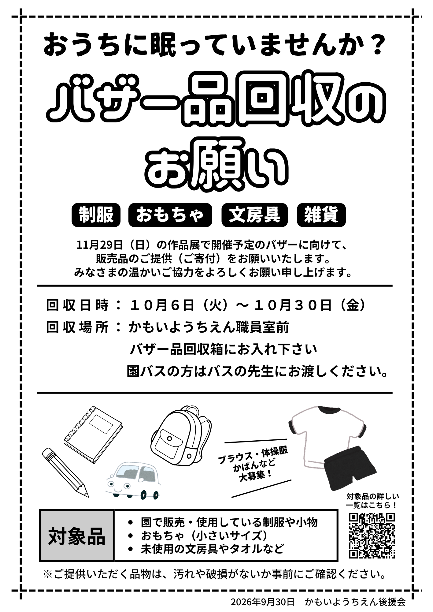
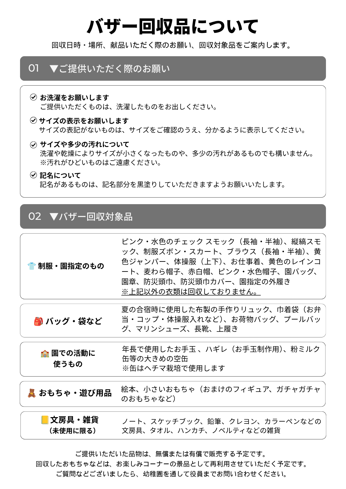
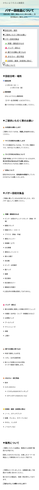

# 幼稚園バザー｜案内・寄付募集の情報設計

## 概要

幼稚園のバザーに向けた、寄付品募集のお知らせ・Webページの制作。

保護者が「何を提供すればよいのか」「詳しい内容はどこで確認できるのか」を判断しやすくなるよう、情報整理から構成・デザイン・Webページ制作まで行った。

依頼された内容をそのまま掲載するのではなく、**寄付する側の視点から情報を整理し、具体的な行動につながる表現に整えること**を意識した。

## 制作の背景

会長から、バザー品回収の配布物を作成したいと依頼を受けた。

昨年の配布物が見つからなかったため、インターネット上のバザー・寄付品募集の事例を参考に、必要な情報を調査・整理し、構成から制作した。

当初はお知らせ1枚の予定だったが、バザー担当者から寄付品の詳細も加えてほしいと依頼があり、チラシと詳細資料を作成。

在園児保護者にはチラシと詳細資料、卒業生にはチラシを配布する形とした。

また、詳細な情報を確認できるよう、WebページとQRコードを組み合わせた構成とした。

完成したチラシは園長にも見ていただき、デザインを気に入っていただいたことで、**園の送迎バスにも掲示することになった。**

## 制作の流れ

### 01｜情報収集・構成

昨年の箇条書きや担当者からの情報をもとに、必要な情報を整理。

インターネット上の事例も参考にしながら、バザーのお知らせと寄付品募集の構成を作成した。

### 02｜デザイン案の確認

複数のデザイン案を作成し、会長に確認。

ポスター形式の案が「見やすい」と評価され、チラシのデザインとして採用された。

### 03｜寄付品の分類を見直す

当初の寄付品は、

**制服｜おもちゃ｜日用品｜文房具**

という分類だった。

しかし「日用品」について具体的な内容を確認すると、ポーチ・お皿・タオル・ハンカチなどが挙げられ、保護者が「何を出せばよいのか」を判断しにくい状態だった。

そこで、家庭に未使用のまま残っていそうなものという視点から内容を整理し、**「日用品」を「雑貨」に変更。**

具体例として「ノベルティ」などを挙げる形にした。

一方、文房具は分類を変えず、

> 鉛筆・クレヨン・ノート・カラーペンなど

具体例を増やし、家庭にあるものと照らし合わせやすくした。

最終的な分類は、

**制服｜おもちゃ｜文房具｜雑貨**

となった。

### 04｜紙とWebの役割を分ける

チラシには概要を掲載し、詳細な寄付品情報はWebページに整理。

QRコードからWebページへ移動できるようにし、紙面の情報量を抑えながら、必要な情報を詳しく確認できる構成とした。

### 05｜掲示場所が広がる

完成したチラシは配布だけでなく、園の送迎バスにも掲示されることになった。

## 制作物

### 1. バザー案内・寄付品募集チラシ

バザーの概要と寄付品募集についてまとめたチラシ。

在園児保護者・卒業生への配布に使用し、在園児保護者には寄付品の詳細資料も配布した。

QRコードからWebページへ誘導する構成とした。

### 2. 寄付品詳細

在園児保護者向けに、寄付対象となる品目をより詳しく確認できる資料を作成。

### 3. 詳細Webページ

Google Sitesを使用し、寄付品の詳細やバザーに関する情報を掲載。

### 4. QRコード

チラシからWebページへ移動するための導線として設置。

### 5. 送迎バス掲示

制作したチラシを、園の送迎バスにも掲示。

## 情報設計で意識したこと

### 「日用品」という分類を見直す

「日用品」という言葉だけでは、募集しているものが分かりにくかったため、具体的に挙がった品物から内容を整理。

**家庭に未使用のまま残っていそうなものは何か**という視点から、「日用品」を「雑貨」に変更し、具体例を加えた。

### 大分類と具体例を使い分ける

すべての分類を変更するのではなく、

- 「日用品」→「雑貨」：分類そのものを見直す
- 「文房具」：分類は維持し、具体例を増やす

というように、情報が伝わりにくい原因に合わせて整理方法を変えた。

### 紙とWebで情報量を分ける

チラシでは概要を伝え、詳しい内容はWebページへ。

QRコードを使って紙からWebへつなげることで、媒体ごとの役割を分けた。

## デザインで意識したこと

- 一目で内容が分かる情報の優先順位
- 見出しと本文のメリハリ
- 寄付してほしいものを視覚的に把握できる構成
- 印刷時の見え方を考慮した文字色・コントラスト
- Webへ自然につながる導線
- 保護者が「自分が何を出せるか」を判断しやすい具体的な表現
- 未使用品を募集することが伝わる表現

## 使用ツール

- Canva
- Google Sites
- QRコード作成ツール

## 制作を通して

今回の制作では、単に依頼された内容をデザインするのではなく、**「誰に、何を、どのように伝えれば、実際の行動につながるか」**という視点から情報を整理した。

特に、同じ「情報を具体化する」という作業でも、

**分類そのものを見直すものと、具体例を増やすものを分けて考えた。**

「何を募集しているのか」が曖昧な部分は分類を見直し、分類自体は分かりやすいものについては具体例を増やすことで、受け手が判断しやすい情報へ整理した。

今回の制作を通して、**依頼内容を確認し、受け手に伝わる形へ情報を整理・再構成すること**の重要性を実感した。

